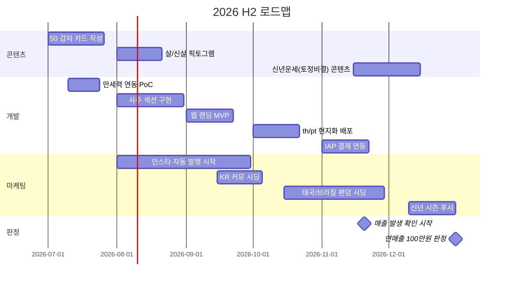

# 🔮 Totune Planning Space — 2026 하반기

> **목표 한 줄:** 해외(태국·브라질)에서 수익 내는 K-사주 × 타로 앱으로 전환. 연내 매출 ₩1,000,000 발생 여부로 2027 방향 판정.

- 상세 플랜: [`docs/2026-H2-PLAN.md`](docs/2026-H2-PLAN.md)
- 마케팅 플랜 (세대 전략 · 예산 티어 · 자동화): [`docs/MARKETING-PLAN.md`](docs/MARKETING-PLAN.md)
- 주간 동향 아카이브: [`docs/trends/`](docs/trends/) — 매주 월 09:00 자동 생성
- 비주얼 대시보드: [`dashboard/index.html`](dashboard/index.html) — GitHub Pages 켜면 웹으로 봄 (Settings → Pages → main /dashboard)

**⚙️ 동향 자동화 켜기 (한 번만):** Settings → Secrets → Actions → `ANTHROPIC_API_KEY` 등록 → Actions 탭 "Weekly Trends" 수동 Run 1회로 동작 확인

---

## 🎯 판정 기준 (연말)

| 기준 | 수치 | 판정 |
|---|---|---|
| 매출 | ₩1,000,000 (~$700) | 도달 → 2027 글로벌 확장 / 미달 → 수익모델 재설계 |
| 최소 성립선 | 유료 결제 유저 50명+ | 이 밑이면 "팔리는 물건인가" 자체를 재검토 |
| 바이럴 신호 | 카드 공유 발 유입 주 100+ | 사주 카드가 진짜 소셜 화폐인지 확인 |

---

## 🗓 월별 마일스톤 (6장 스프레드)

| 월 | 테마 | 핵심 산출물 | 상태 |
|---|---|---|---|
| **7월** | 콘텐츠 완성 | 50 갑자 카드 텍스트 완료 · 사주 PRD 확정 | 🟡 진행중 |
| **8월** | 사주 개발 | 만세력 연동 · 카드 60종 이미지 · 공유 기능 | ⚪ 대기 |
| **9월** | 사주 런칭 | 사주 섹션 v1 배포 (KR/EN) · 웹 랜딩 MVP | ⚪ 대기 |
| **10월** | 글로벌 | 태국어·포르투갈어 배포 · 최애 궁합 | ⚪ 대기 |
| **11월** | 수익화 | 복채(팁) IAP · 광고제거 $1.99 · 심층 카드 | ⚪ 대기 |
| **12월** | 신년 대목 | 2027 신년운세 · 시즌 푸시 · **매출 판정** | ⚪ 대기 |

상태: ⚪ 대기 · 🟡 진행중 · 🟢 완료 · 🔴 지연

---

## 👥 롤별 이번 달 (7월)

| 롤 | 담당 | 이번 달 할 일 |
|---|---|---|
| 기획/마케팅 | 진구 | 50 갑자 카드 완성 · 사주 PRD 확정 · 태국/브라질 시장 리서치 |
| 개발 | 파트너 | 만세력 PoC · health 프롬프트 재테스트 배포 · 계정삭제 API 착수 |
| 디자인 | 디자이너 | 갑자 카드 앞/뒤 템플릿 · 햄버거 메뉴 구조 시안 |
| 영어 검수 | 파트너 | 60갑자 영어 카피 최종 검수 (완료본 60줄) |

---

## ⚠️ 크리티컬 패스

1. **7월 갑자 카드 50장** — 이게 밀리면 전부 밀림. 콘텐츠가 개발보다 먼저다.
2. **11월 결제 연동** — 12월 신년 대목 전에 IAP가 살아있어야 매출 판정이 가능. 운세 앱 매출의 최대 대목은 12월 말~1월.
3. **웹 랜딩** — 태국/브라질 시딩은 앱스토어 링크로는 절반이 이탈. 웹에서 카드 1장 뽑기가 최소 조건.

## 📌 규칙

- 매주 월요일: 이 README 상태 이모지 업데이트
- 매월 말: `docs/2026-H2-PLAN.md`의 해당 월 회고 섹션 채우기
- 산출물 파일은 `docs/` 하위에 월별 폴더로
